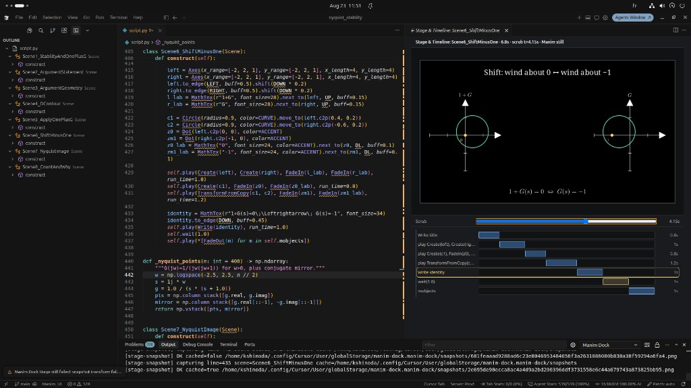

# Manim Dock

**Manim Dock** (`manim-dock`) is an open-source VS Code companion for [Manim Community](https://www.manim.community/) educational video production.

It docks Outline and a unified **Stage & Timeline** beside your normal Manim Python — so pacing and frame checks stop being pure trial-and-error — while coding facilitation (snippets, templates, libraries) speeds up structure and reuse.

> For people who **write Manim**. Not a no-code replacement for learning Python.



## Status

**Current:** [`v0.2.4`](https://github.com/koseishinoda/manim-dock/releases/tag/v0.2.4) — versioning is **git tags / GitHub Releases** only (see [CHANGELOG.md](CHANGELOG.md)).

- Product docs: [architecture](docs/architecture.md) · [decisions](docs/decisions.md) · [sideview](docs/sideview.md)

Requires ManimCE for Stage stills and rendering (`manimDock.pythonPath` → your venv). Sideview remains optional for a richer player — see [docs/sideview.md](docs/sideview.md).

**Try Stage & Timeline:** open `examples/minimal_lesson/lesson.py` (or Nyquist) → Outline / command **Manim Dock: Open Stage & Timeline** → scrub; after ~1s a Manim still appears. Timeline edge-drag / reorder patches durations (confirm-diff, or `manimDock.patchMode` = `auto`).

**Try templates:** Command **Manim Dock: Insert Template**, or copy from `templates/`, or **Scaffold Example Project**.

**Try library extract:** Outline → right-click a method → **Extract Method to Library**, or use `examples/lesson_lib` + `examples/lesson_with_lib/lesson.py` (`PYTHONPATH=examples`).

## Product pillars

1. **Outline + Stage & Timeline** — jump-to-source, Manim stills at scrub, duration/reorder patches
2. **Coding facilitation** — educational snippets/templates, section scaffolds, library extract

## Repository layout

```text
├── package.json          # VS Code extension
├── src/                  # Extension host (TypeScript)
├── media/                # Icons + Stage/Timeline webview JS
├── python/               # Sidecar: outline, timeline, snapshot, patches, render
├── examples/             # Sample ManimCE lessons
├── templates/            # File templates (basic / multi-section / multi-scene)
├── snippets/             # Educational snippet stubs
├── docs/                 # Architecture, decisions, Sideview coexistence
└── LICENSE / CHANGELOG
```

## Quick start (development)

### Python sidecar

```bash
cd python
python3 -m venv .venv && source .venv/bin/activate   # if available
pip install -e ".[dev]"                              # pulls libcst + pytest
# From repo root, prefer:
#   /path/to/Manim_UI/.venv/bin/python -m pytest python/tests -q
PYTHONPATH=. python3 -m manim_dock.cli outline ../examples/minimal_lesson/lesson.py
PYTHONPATH=. python3 -m manim_dock.cli timeline ../examples/minimal_lesson/lesson.py MinimalLesson
PYTHONPATH=. python3 -m manim_dock.cli snapshot ../examples/minimal_lesson/lesson.py MinimalLesson 47
```

### VS Code extension (development)

```bash
npm install
npm run compile
# Then: Run Extension (F5) — launch config "Run Manim Dock Extension"
# Set manimDock.pythonPath to the repo .venv that has ManimCE
# Open examples/minimal_lesson/lesson.py → Open Stage & Timeline
```

### Install from VSIX

See [CONTRIBUTING.md](CONTRIBUTING.md).